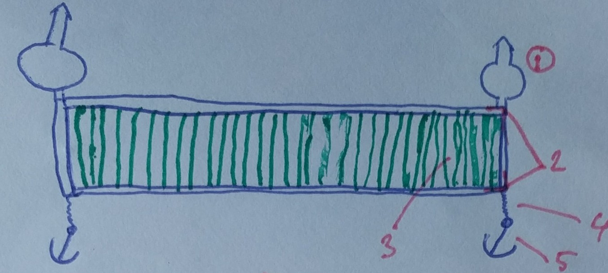
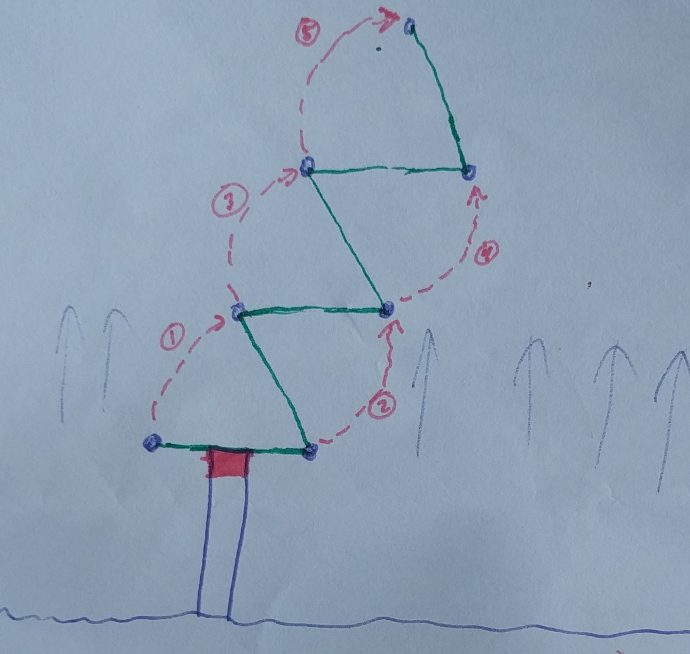
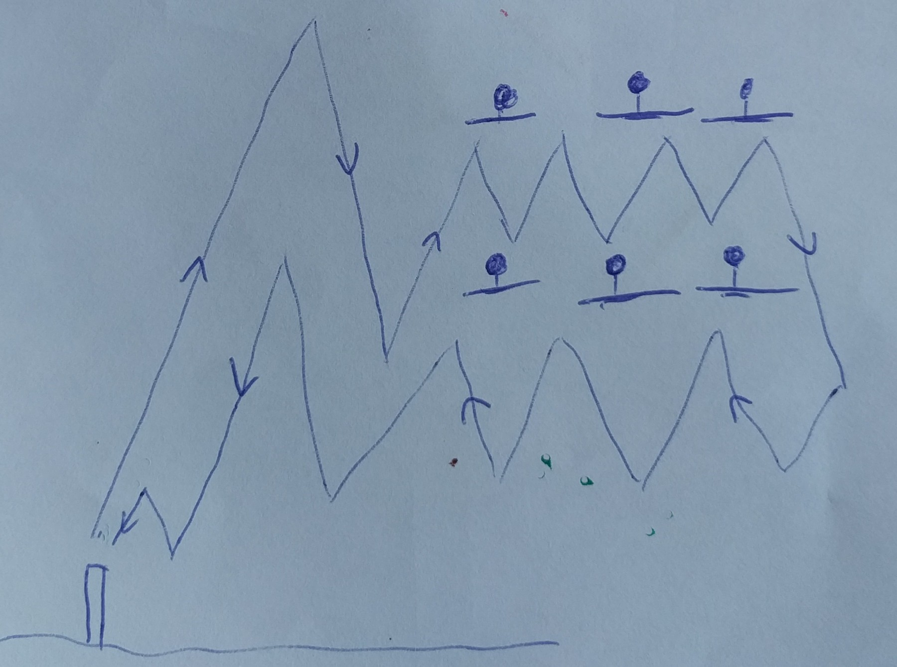

## Het probleem

Hoe zorg je ervoor dat je zeewier op open zee kunt kweken, terwijl je niet de kosten en timingsproblemen hebt van het zaaien en oogsten op open zee.

## Mogelijke oplossing

Een net wat op afstand bestuurd kan worden wat met behulp van de getijden zelf de zee op kan varen en weer aan land kan komen. Dit kan er bijvoorbeeld als volgt uitzien:

Legenda:

  1. drijvende boeien
  2. metalen frame
  3. teelt lijnen
  4. ankerlijn
  5. anker

Deze constructie kan dan een route volgen door de ankers 1 voor 1 te laten zakken, zoals hier aangegeven (vertrekpunt is vanaf een pier waar gezaaid en geoogst kan worden):

Door nu meerdere van deze netten een parcours te laten afleggen, zoals hieronder, kan een groot oppervlakte van de zee gebruikt worden voor de teelt zonder dat er (vervuilende) schepen hoeven te worden ingezet.

